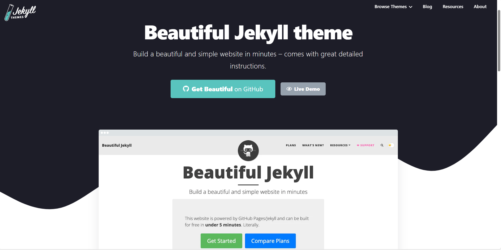
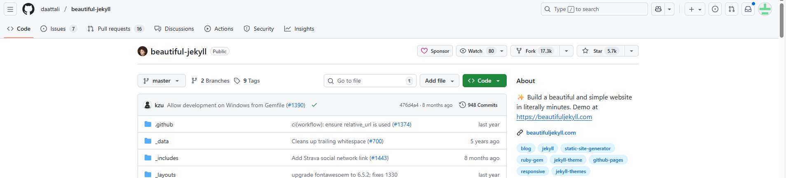
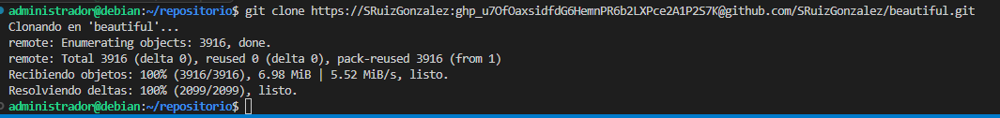
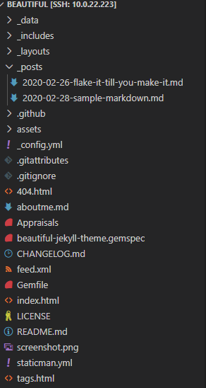
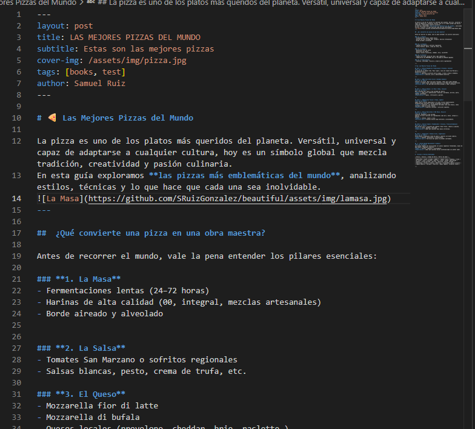
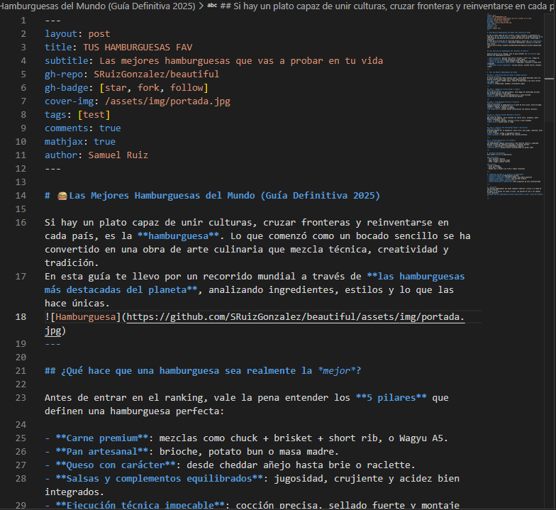
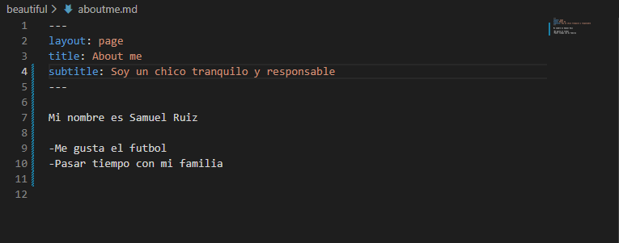

# EJERCICIO 3
## SAMUEL RUIZ

## PASO 1
1. Entramos en la web de jekyll themes y elegimos un tema que nos gste miraremos la demo

## PASO 2
2. Despues haremos un fork a nuestro usuario de **GitHub** 

## PASO 3
3. Y el siguiente paso sera hacer un `git clone` en el visual studio

## PASO 4
4. Ya tenemos todos los archivos del tema beautiful para editar.

## PASO 5
5. Empezamos a editar los posts a un tema que elegiremos nosotros.Este es el primer post.

## PASO 6
6. Este es el segundo post que vamos a editar.

## PASO 7
7. Ahora editaremos el about me.md y pondremos todo lo nuestro.

